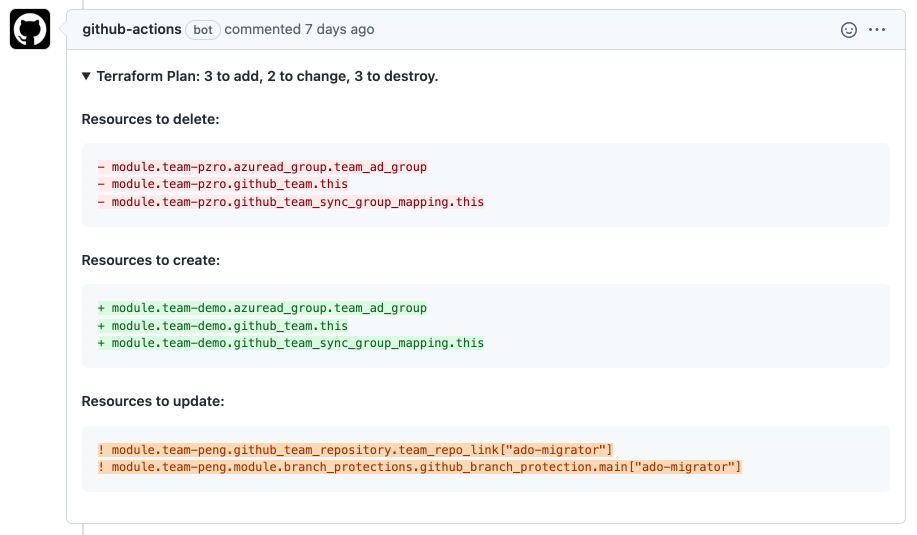
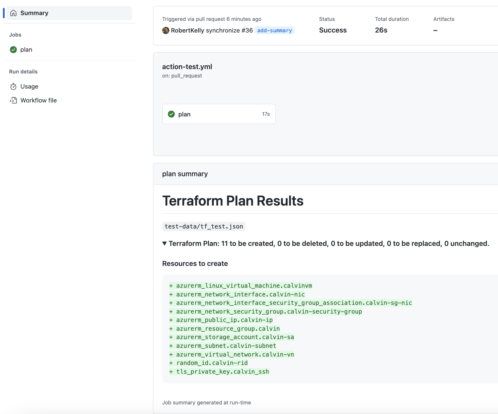

# Terraform Change Pull Request Commenter Action
This GitHub Action reads changes from your Terraform plan JSON output, summarizes the changes, and posts them in a single GitHub Pull Request comment.

We recommend using this in your Infrastructure as Code delivery workflow to make any change visible and acclerate the PR review process.

## Why is this GitHub Action different than the other Terraform Plan commenters?

Implementing this Action is _super_ simple and the comments are consise and easy to read. Other implementations may be heavily opinionated or require adding multiple jobs to your workflow.

## Features

- Display changes in a Terraform plan without posting larger sections of the plan change log. This approach will, in most cases, avoid the situation where plan contents are too large for a single PR comment. 
- Collapsed as a summary by default, when expanded, the comment is broken up into sections for  deletion, creation, and resource changes. The changes are also color-coded to help draw attention to each proposed modification.
- This JavaScript GitHub Action runs directly on a host runner and executes faster than a Docker container Action.

### Example Comment


## Inputs

## `expand-comment`

**Optional** Boolean defaults to `false`

- Will expand the changes in comments by default rather than having them collapsed beneath the summary

### `json-file`

**Optional** Defaults to `tfplan.json`

- The location of the JSON file created by running `terraform show -no-color -json tfplan.plan > tfplan.json` (Or whatever you choose to name your plan or json outputs)

- Multiple files can be provided using a text block.

## Example usage
Single plan file:
```yaml
uses: liatrio/terraform-change-pr-commenter@v1.4.0
with:
  json-file: my-tfplan.json
  expand-comment: 'true' 
```
Multiple plan files:
```yaml
uses: liatrio/terraform-change-pr-commenter@v1.4.0
with:
  json-file: |
    core-infra-tfplan.json
    shared-infra-tfplan.json
```
Include plan output to the Actions workflow job summary:
```yaml
uses: liatrio/terraform-change-pr-commenter@v1.4.0
with:
  json-file: my-tfplan.json
  expand-comment: 'true'
  include-plan-job-summary: 'true'
```
**Note:** 
- When `include-plan-job-summary = true`, if the action is executed in non-Pull Request workflows, the plan output will also be posted to the job summary of that run. If you do not wish to have this behavior, apply conditional logic to your workflow file.
#### Example Job Summary Output


## Terraform Configuration / Known Issues
#### Known issue when including the [Terraform Wrapper script](https://github.com/hashicorp/setup-terraform#inputs)
- Execution may error with `Error: Unexpected token c in JSON at position 1`
  - **Cause**: Terraform wrapper enabled (default behavior) causes invalid JSON in Terraform output.
  - **Fix**: Exclude the Terraform Wrapper when setting up Terraform (*GitHub Actions example*)
    ```yaml
    - name: Setup Terraform
      uses: hashicorp/setup-terraform@v2
      with:
        terraform_wrapper: false
    ```

## Contributing or Submitting Issues

### Contributions are welcome!
If you'd like to suggest changes, feel free to submit a Pull Request or [open an issue](https://github.com/liatrio/terraform-change-pr-commenter/issues/new).

Otherwise if things aren't working as expected, please [open a new issue](https://github.com/liatrio/terraform-change-pr-commenter/issues/new). Pleae include code references, a description of the issue, and expected behavior.

--- 


[](https://github.com/semantic-release/semantic-release)
